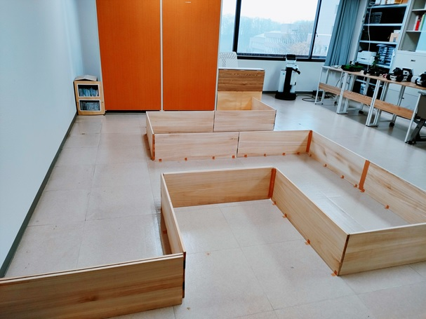
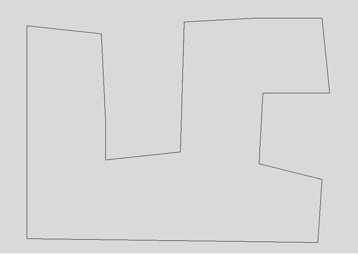
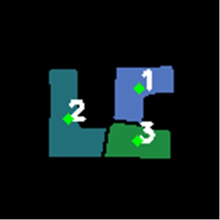

# vector_map: creates vector maps from occupancy maps generated by SLAM.

## (beta)
# vector_map
Vector maps consist of geometric elements such as straight lines and curves, and are extremely suitable for robot action planning using algebraic geometry methods and AI methods. This is created by removing noise from the occupancy map information generated by SLAM, extracting line segment elements consisting of single straight lines and curves, and accurately identifying the position of the corners between line segment elements. The vector_map library performs these processes, and also has functions that make it easier to handle topological structures by representing the created vector map as a set of hierarchical objects.

test environment<br>
<br>
<br>
point cloud map by raw SLAM output<br>
<br>
<br>
vector map<br>
<br>
<br>
automatic division of vector map<br>
<br>

## Install

```
mkdir <work_dir>

cd <work_dir>

git clone https://github.com/RobotSpatialCognition/vector_map.git

cd vector_map
 -> <work_dir>/vector_map
 
pip3 install -e .
```


## Demo
- usage sample
```
python3 test/test1.py
```

- full demo  
[pytwb_demo](https://github.com/momoiorg-repository/pytwb_demo)

## Document
[vector_map api](./doc/overview.md)

## Paper
- Wataru Mita, Johei Matsuoka, and Kazuya Tago,
”A Vectorized Map Library as a Platform for Higher
Layer Planning for Mobile Robots," International Workshop on Smart Info-Media Systems in Asia (SISA), IEICE, 2023 (to appear).


